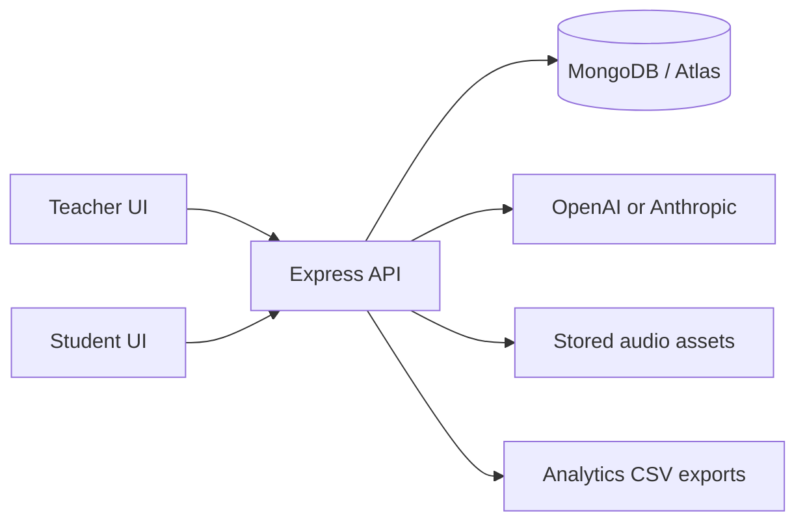

# SpellWise

SpellWise is a full-stack research platform for studying how spelling interventions affect immediate and delayed orthographic and semantic retention.

Teachers create experiments with target words and stories. Students join with an experiment code, complete story-based spelling tasks under an assigned condition, rate mental effort and difficulty, and return later for recall testing. Responses and progress are persisted for research analysis.

## Research model

Each experiment uses two stories and two within-participant conditions:

- **Treatment:** an intervention exercise is triggered after an incorrect spelling attempt.
- **Control:** the correct spelling is provided after an incorrect attempt.

The story-to-condition assignment is counterbalanced. Older database labels `with-hints` and `without-hints` are retained for compatibility; in the current student experience they represent the intervention and control conditions.

```text
Consent and tutorial
        |
Story 1 -> paragraph effort/difficulty ratings
        |
Story 2 -> paragraph effort/difficulty ratings
        |
Break and delayed-recall unlock
        |
Recall -> semantic definitions -> final questionnaires
```

The delayed recall test normally unlocks after a 12-hour minimum interval. Saved progress allows a student to resume after refresh or a later visit.

## Features

### Teacher workspace

- Create and configure experiments.
- Add target words and CEFR levels, including C1 and C2 medical vocabulary.
- Generate stories with repeated target-word occurrences.
- Generate sentence-level and word-level audio.
- Launch experiments and assign students.
- Review attempts, interventions, effort ratings, recall, participation, and CSV exports.

### Student experience

- Join with an experiment code after accepting consent terms.
- Follow an in-app tutorial before the first test.
- Read stories in the fixed read mode.
- Play audio for individual sentences.
- Complete spelling blanks embedded in story text.
- Receive treatment interventions or control feedback according to assignment.
- Rate perceived difficulty and mental effort on the Paas 1-9 scale.
- Complete immediate and delayed orthographic and semantic recall tasks.
- Resume saved progress after refresh or a later visit.

## Architecture



```text
SpellWise/
├── client/                 React + Vite student and teacher UI
├── server/                 Express API, auth, persistence, AI, analytics
├── shared/                 Shared TypeScript contracts
├── docs/                   Architecture and application-flow notes
├── mongodb_backup_data/    Local MongoDB backup artifacts
├── Dockerfile              Production multi-stage image
├── docker-compose.yml      Local container setup
└── nginx.conf              Production proxy configuration
```

Important areas:

- `client/src/routes/student/RunFull.tsx`: story-learning flow.
- `client/src/routes/student/StudentTest.tsx`: recall and final survey flow.
- `client/src/routes/student/components/StoryReader.tsx`: story and sentence audio rendering.
- `server/src/routes/student.ts`: student attempts, progress, interventions, and recall.
- `server/src/routes/studentExtra.ts`: effort, difficulty, consent, and completion.
- `server/src/routes/experiments.ts`: experiment, story, and audio generation.
- `server/src/routes/analytics.ts`: dashboards and CSV exports.
- `server/src/models/`: MongoDB schemas.

## Technology

React 18, TypeScript, Vite, Tailwind CSS, Zustand, TanStack Query, Express, Mongoose, MongoDB, OpenAI, Anthropic, Jest, Supertest, ESLint, Prettier, Docker, and Nginx.

## Requirements

- Node.js 18 or newer
- npm 9 or newer
- MongoDB locally or a MongoDB Atlas connection
- OpenAI API key for AI story/audio features
- Optional Anthropic API key for alternate story generation

## Local setup

From the repository root:

```bash
npm install
```

Create `server/.env`:

```env
NODE_ENV=development
PORT=4000
MONGO_URI=mongodb://127.0.0.1:27017/spellwise
CORS_ORIGIN=http://localhost:5173
APP_BASE_URL=http://localhost:5173
JWT_ACCESS_SECRET=replace-with-a-long-random-secret
JWT_REFRESH_SECRET=replace-with-a-different-long-random-secret
OPENAI_API_KEY=your-openai-key
OPENAI_MODEL=gpt-4o-mini
OPENAI_TTS_MODEL=gpt-4o-mini-tts
OPENAI_TTS_VOICE=nova
```

The client defaults to `http://localhost:4000` in development. Set `VITE_API_BASE_URL` in `client/.env` to override it.

Start both applications:

```bash
npm run dev
```

- UI: `http://localhost:5173`
- API: `http://localhost:4000`
- API docs: `http://localhost:4000/api-docs`

Create a teacher account:

```bash
npm run create-teacher --workspace=@spellwise/server
```

## Build and test

```bash
npm run build
npm run lint
npm run test --workspace=@spellwise/server
```

Targeted commands:

```bash
npm run build --workspace=@spellwise/client
npm run build --workspace=@spellwise/server
npm run test:ci --workspace=@spellwise/server
```

## Data and analysis

Production app data is stored in MongoDB, normally MongoDB Atlas. Core collections include:

- `assignments`: participant assignment, story order, condition mapping, and recall timing.
- `attempts`: spelling and recall responses, phase, score, and target word.
- `interventionattempts`: exercise type, responses, correctness, and completion.
- `effortresponses`: paragraph-level mental effort and difficulty ratings.
- `events`: consent, progress, audio, attempts, intervention, recall, and workflow events.
- `stories`: generated text, paragraphs, target occurrences, and audio metadata.
- `users`, `experiments`, `conditions`, and `wordmetadatas`: study configuration and participant data.

Analytics exports support treatment/control comparisons for immediate spelling, delayed orthographic recall, immediate and delayed semantic recall, effort, difficulty, intervention exposure, completion, and timing. Keep exported CSV files confidential and never commit `.env` files, secrets, or participant-identifying data.

## Production deployment

The `Dockerfile` builds the shared package, server, and client, then serves the compiled client through the production server. Configure these variables in the hosting provider:

```env
NODE_ENV=production
PORT=4000
MONGO_URI=mongodb+srv://...
CORS_ORIGIN=https://your-domain.example
APP_BASE_URL=https://your-domain.example
JWT_ACCESS_SECRET=long-random-production-secret
JWT_REFRESH_SECRET=different-long-random-production-secret
OPENAI_API_KEY=your-openai-key
```

Local container startup:

```bash
docker compose up --build
```

For Render or another container host, expose the configured `PORT`, use a MongoDB Atlas URI, and ensure the deployed origin exactly matches `CORS_ORIGIN`.

## Research operations

- Use separate development and production databases.
- Back up MongoDB before schema or deployment changes.
- Test a complete student flow with a test experiment before inviting participants.
- Verify condition mapping, recall timing, audio assets, and progress restoration before data collection.

## Documentation

- [Application flow](docs/APP_FLOW.md)
- [Architecture](docs/ARCHITECTURE.md)
- [Thesis framework](THESIS_FRAMEWORK.md)
- [Thesis analysis](THESIS_ANALYSIS.md)
- [Final thesis preparation](thesis%20final%20prep.md)
- [Iteration notes](thesis%20iteration%20notes.md)

## License

SpellWise is an internal research and educational prototype. Usage and redistribution must follow the applicable institutional, research, and data-protection requirements.
